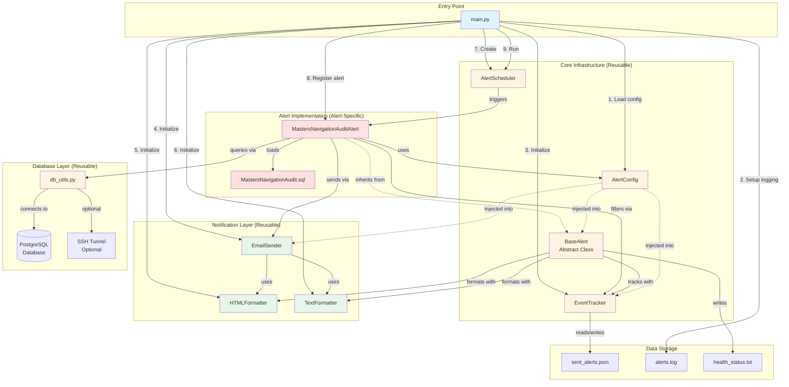
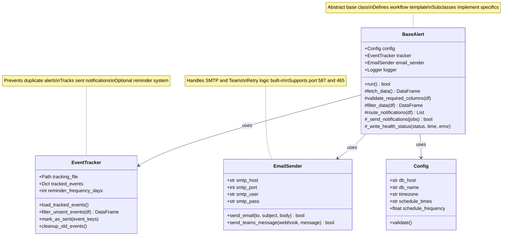
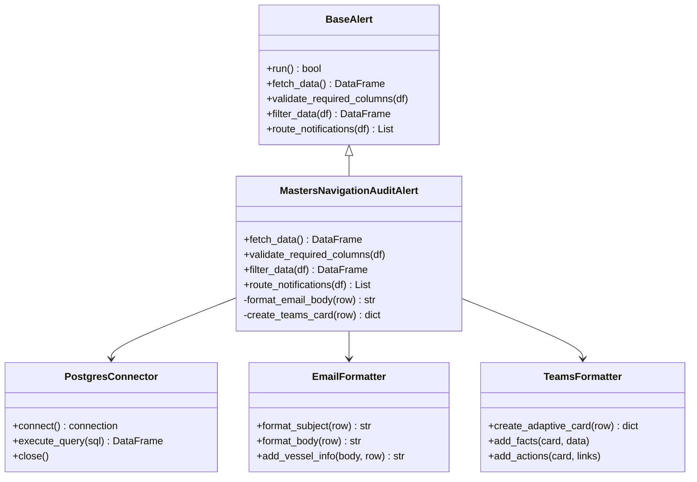
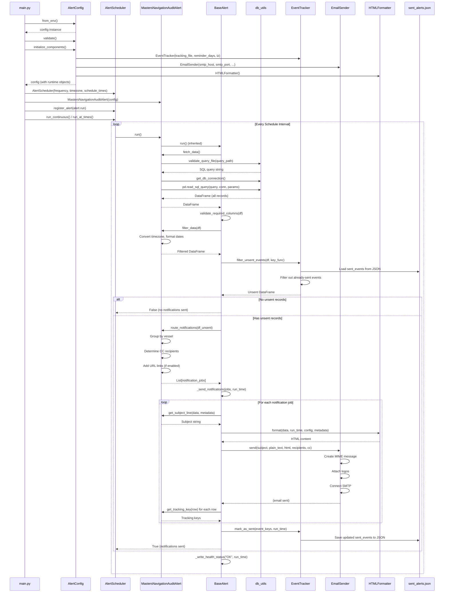
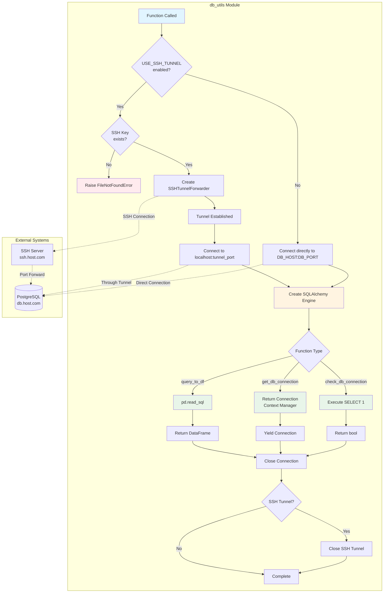
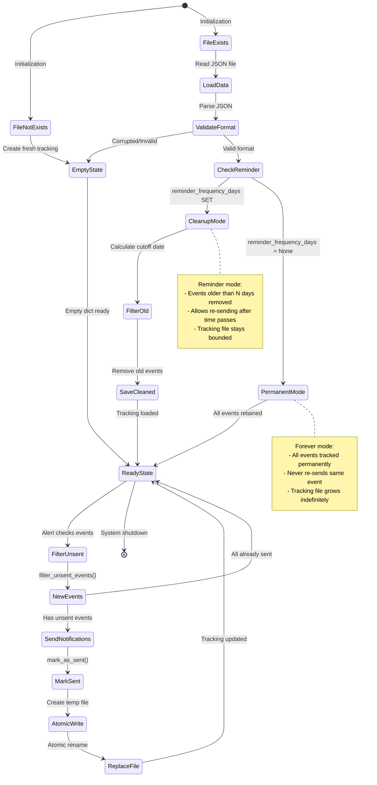
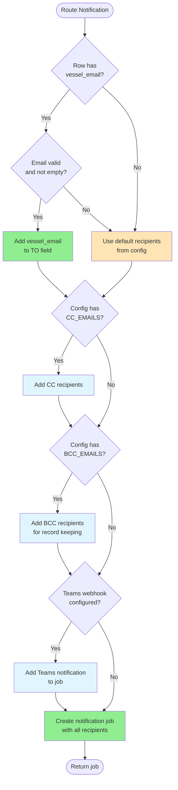
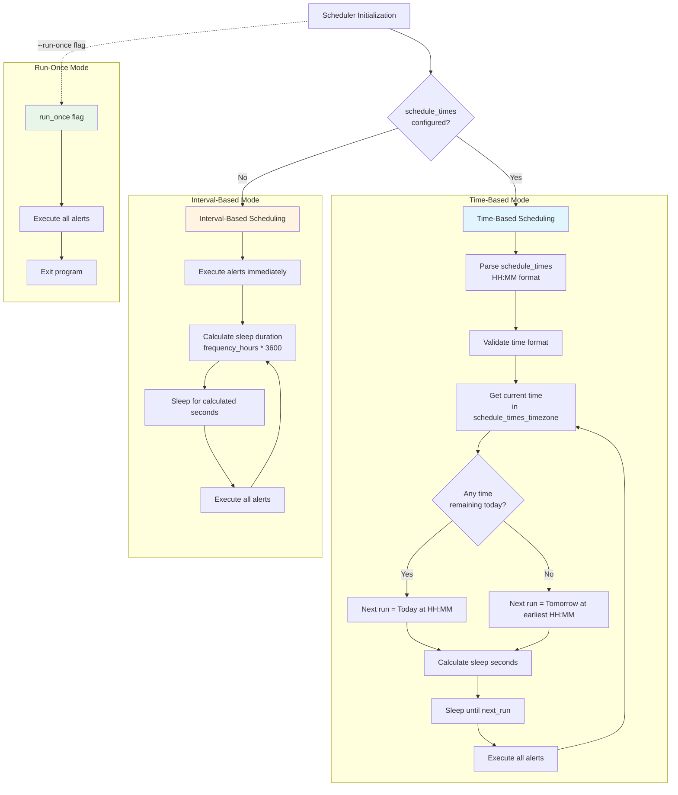
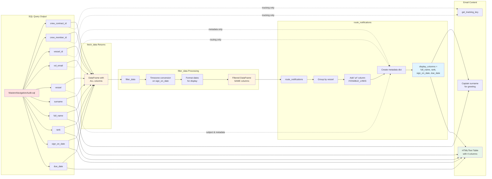

# Master's Navigation Audit Alert System - Mermaid Diagrams

## 1. High-Level System Architecture

## 2. Core Infrastructure Class Diagram (Reusable Components)

Shows the foundational base classes that all alert projects inherit from: BaseAlert orchestrates the workflow, EventTracker manages deduplication, and EmailSender handles notifications.

## 3. Alert-Specific Implementation (Masters Navigation Audit)

Concrete implementation example: MastersNavigationAuditAlert extends BaseAlert and implements the four required methods (fetch, validate, filter, route) with domain-specific logic.

## 4. Complete Workflow Sequence Diagram

## 5. Data Flow Diagram

```mermaid
graph LR
    subgraph "1. Configuration"
        ENV[.env file]
        ENV --> CONFIG[AlertConfig.from_env]
    end
    
    subgraph "2. Database Query"
        SQL[MastersNavigationAudit.sql]
        SQL --> FETCH[fetch_data]
        FETCH --> DB[(PostgreSQL)]
        DB --> RAW[Raw DataFrame<br/>All Masters]
    end
    
    subgraph "3. Filtering"
        RAW --> FILTER[filter_data]
        FILTER --> TZ[Timezone Conversion]
        TZ --> DATE[Date Formatting]
        DATE --> FILTERED[Filtered DataFrame<br/>Recent Sign-ons]
    end
    
    subgraph "4. Tracking"
        FILTERED --> TRACK[filter_unsent_events]
        TRACKING[(sent_alerts.json)] --> TRACK
        TRACK --> UNSENT[Unsent DataFrame<br/>New Events Only]
    end
    
    subgraph "5. Routing"
        UNSENT --> ROUTE[route_notifications]
        ROUTE --> GROUP[Group by Vessel]
        GROUP --> CC[Add CC Recipients]
        CC --> LINKS[Add URL Links]
        LINKS --> JOBS[Notification Jobs<br/>List of Dicts]
    end
    
    subgraph "6. Formatting"
        JOBS --> SUBJECT[get_subject_line]
        JOBS --> HTML[HTMLFormatter.format]
        JOBS --> TEXT[TextFormatter.format]
        
        SUBJECT --> EMAIL_COMP[Email Components]
        HTML --> EMAIL_COMP
        TEXT --> EMAIL_COMP
    end
    
    subgraph "7. Sending"
        EMAIL_COMP --> SEND[EmailSender.send]
        LOGOS[media/*.png] --> SEND
        SEND --> SMTP[SMTP Server]
        SMTP --> RECIPIENTS[Email Recipients]
    end
    
    subgraph "8. Update Tracking"
        SEND --> UPDATE[mark_as_sent]
        UPDATE --> TRACKING
    end
    
    style CONFIG fill:#fff4e1
    style FETCH fill:#ffe1e1
    style FILTER fill:#ffe1e1
    style TRACK fill:#fff4e1
    style ROUTE fill:#ffe1e1
    style HTML fill:#e8f5e9
    style SEND fill:#e8f5e9
    style UPDATE fill:#fff4e1
```

## 6. Database Connection Flow

## 7. Tracking System State Machine

## 8. Email Routing Decision Tree

Decision flow for determining email recipients: checks for vessel-specific contacts, falls back to default recipients, and applies BCC rules for record-keeping.

## 9. Scheduler Timing Modes

## 10. Column Flow: From Database to Email

## Legend

- **Yellow boxes** (🟨): Core infrastructure (reusable)
- **Green boxes** (🟩): Notification/formatting layer (reusable)  
- **Red boxes** (🟥): Alert-specific implementation
- **Blue boxes** (🟦): Entry points and configuration
